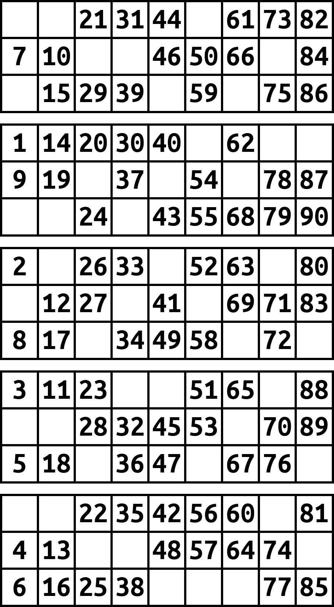

# 🎱 Bingo

**Bingo** is a Python-based tool that generates custom Bingo sheets using a unique format of **five 3×9 rectangles** instead of the traditional six. It's perfect for custom games, classroom activities, or just having fun with a twist on the classic Bingo layout.

## 📌 Features

- 📄 Generates **any number** of Bingo sheets by passing the desired count as an argument.
- 🎨 Optionally specify a **light background color** using any valid HTML color name.
- 🧩 Each sheet contains **five 3×9 rectangles**, differing from the standard six-grid layout.
- 🖼️ Outputs the Bingo sheets as PDFs, ready for printing out as DinA4.

## 🛠️ How It Works

Simply call the main function in your script and specify how many Bingo sheets you'd like to generate (default is one). 
Additionally you can specify a light background color with the argument `color` as a string. All common HTML colors can be used (see for example [HTML colors w3schools](https://www.w3schools.com/tags/ref_colornames.asp)).

```python
from Bingo import BingoSheet

# Generate 5 Bingo sheets with a light blue background
BingoSheet(5, color="lightblue")
```

## 🧾 Requirements
Make sure you have the following Python libraries installed:

- `Pillow` (for image creation)
- `Numpy` (for array handling)

Install Pillow using pip:

```bash
pip install Pillow
```
Install Numpy using pip:

```bash
pip install Numpy
```

## Example



## ✅ Fetaure Ideas

- Add *standard* format(six rectangles)